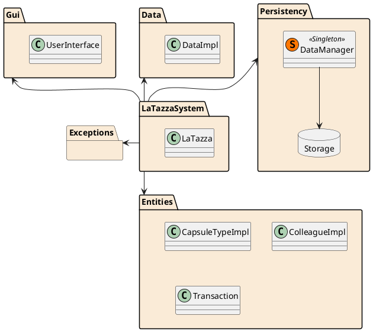
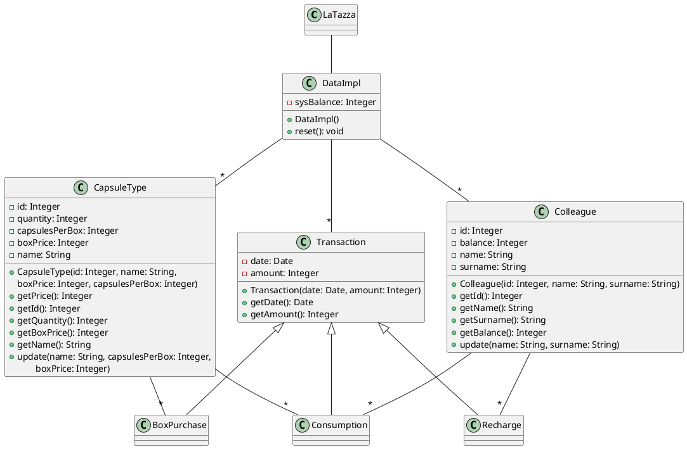

# Design Document Template

Authors: Daniele Palumbo, Magnani Simone, Marchi Riccardo, Postolov Enrico

Date: 18/04/2019

Version: 0.2

# Contents

- [Package diagram](#package-diagram)
- [Class diagram](#class-diagram)
- [Verification traceability matrix](#verification-traceability-matrix)
- [Verification sequence diagrams](#verification-sequence-diagrams)

# Package diagram



# Class diagram



_**Note:**_

In order to realize an exhaustive and high level class diagram, this diagram does not display not only all the low level class-specific information (internal lists, class to manage save/load, etc.), but also all the given DataImpl methods, as their behaviour are comprehensible the same.

# Verification traceability matrix

\<for each functional requirement from the requirement document, list which classes concur to implement it>


|  | Class x | Class y  | .. |
| ------------- |:-------------:| -----:| -----:|
| Functional requirement x  |  |  | |
| Functional requirement y  |  |  | |
| .. |  |  | |

# Verification sequence diagrams 
\<select key scenarios from the requirement document. For each of them define a sequence diagram showing that the scenario can be implemented by the classes and methods in the design>

```plantuml
": Class X" -> ": Class Y": "1: message1()"
": Class X" -> ": Class Y": "2: message2()"
```
