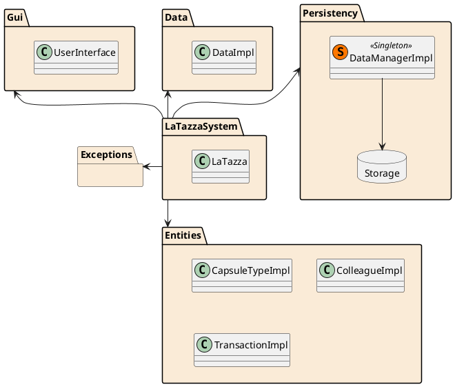
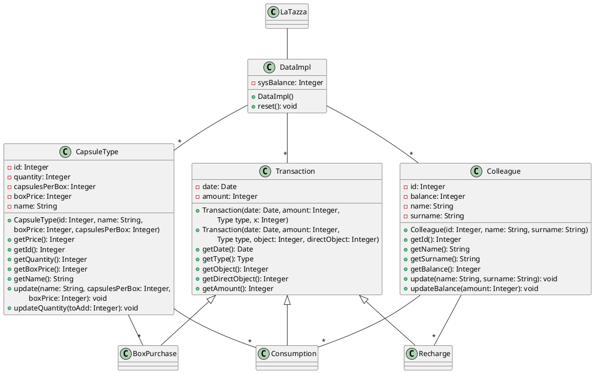
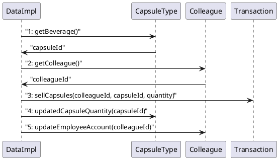
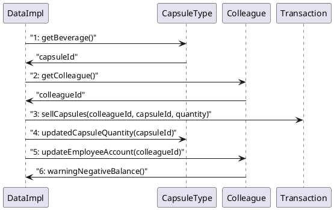

# Design Document Template

Authors: Palumbo Daniele, Magnani Simone, Marchi Riccardo, Postolov Enrico

Date: 18/04/2019

Version: 1.0

# Contents

- [Package diagram](#package-diagram)
- [Class diagram](#class-diagram)
- [Verification traceability matrix](#verification-traceability-matrix)
- [Verification sequence diagrams](#verification-sequence-diagrams)

# Package diagram

_**Note:**_

The class DataManagerImpl responsible of storing and loading information into a database (or a file) will be realized as a static Singleton, since just one connection to the storage system is needed.

# Class diagram

_**Note:**_

In order to realize an exhaustive and high level class diagram, this diagram does not display not only all the low level class-specific information (internal lists, class to manage save/load, etc.), but also all the given DataImpl methods, as their behaviour are comprehensible the same.

# Verification Traceability Matrix

Each functional requirement described in the Requirement Document has a reference to one or more classes of the class diagram. They are listed here below.

|  | Class 1 | Class 2  | Class 3|  Class 4| Class 5|
| ------------- |:-------------:| :-----:| :-----:| :-----:| :-----:|
| FR1   | Colleague |Transaction | CapsuleType | DataImpl | - |
| FR2  | CapsuleType | Transaction | DataImpl | -  | - |
| FR3 | Colleague | Transaction | DataImpl| - | - |
| FR4 | CapsuleType |Transaction | DataImpl| - | - |
| FR5 | Colleague |Transaction | DataImpl| -  | - |
| FR6 |Transaction | DataImpl | - | -  | - |
| FR7 | CapsuleType | DataImpl | -| - | - |
| FR8 | Colleague| DataImpl | -| - | - |

_**Note:**_

We decided not to insert the class DataManagerImpl in this table since it is assumed a priori that in order to perform every operation there should be an update/store of the whole dataset in the database (or file).

# Verification Sequence Diagrams 

## Scenario 1

## Scenario 2

_**Note:**_

It is assumed that after every operation the whole dataset is updated/stored thanks to the DataManagerImpl class.