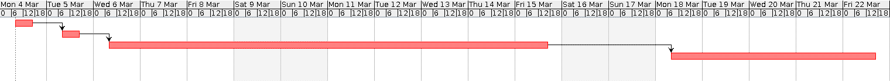

# Project Estimation  template

Authors: Magnani Simone, Marchi Riccardo, Palumbo Daniele, Postolov Enrico

Date: 28/05/2019

Version: 1.0

# Contents

- [Data from your LaTazza project](#data-from-your-latazza-project)
- [Estimate by product decomposition](#estimate-by-product-decomposition)
- [Estimate by activity decomposition ](#estimate-by-activity-decomposition)

# Data from your LaTazza project

###

|         Total person days worked by your  team, considering period March 5 to May 26 (1 person day == 8 person hours)     |   |             
| ----------- | ------------------------------- | 
|Total Java LoC delivered on May 26 (only code, no Junit code) | 619 |
| Total number of Java classes delivered on May 26 (only code, no Junit code)| 5 |
| Productivity P | 5 |
|Average size of Java class A  | 124 |

# Estimate by product decomposition

### 

|             | Estimate                        |             
| ----------- | ------------------------------- |  
| Estimated n classes   |            10                 |             
| Estimated LOC per class  (Here use Average A computed above )      |           124                 |                
| Estimated effort  (person days) (Here use productivity P)  |             248                         |      
| Estimated calendar time (calendar weeks) (Assume team of 4 people, 8 hours per day, 5 days per week ) |        2            |               

# Estimate by activity decomposition

### 

|         Activity name    | Estimated effort    |             
| ----------- | ------------------------------- | 
|Requirements| 30 |
|Design | 16 |
|Coding | 120 |
|Testing | 50 |
|Acceptance Testing | 30 |

### Estimated Gantt

*Figure 1: Estimated Gantt Table*

*Figure 2: Estimated Gantt Chart*
