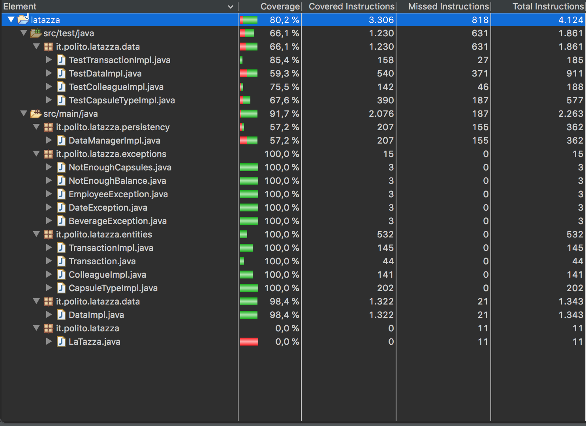

# Unit Testing Documentation template

Authors: Magnani Simone, Marchi Riccardo, Palumbo Daniele, Postolov Enrico

Date: May 18th 2019

Version: 0.1

# Contents

- [Black Box Unit Tests](#black-box-unit-tests)

- [White Box Unit Tests](#white-box-unit-tests)

# Black Box Unit Tests

 ### **Class CapsuleTypeImpl - method CapsuleTypeImpl**

**Criteria for method CapsuleTypeImpl:**
	

 - Sign of ID
 - Sign of box price
 - Sign of capsules per box
 - Quantity of capsules

**Predicates for method CapsuleTypeImpl:**

| Criteria | Predicate |
| -------- | --------- |
| Sign of ID | < 0 |
|| >= 0 |
| Sign of box price | <= 0 |
|| > 0 |
| Sign of capsules per box | <= 0 |
|| > 0 |
| Quantity of capsules | < 0 |
|| >= 0 |

**Boundaries**:

| Criteria | Boundary values |
| -------- | --------------- |
| Sign | Minint, 0, maxint |
| Quantity | Minint, 0, maxint |

**Combination of predicates**:

| Sign of ID | Sign of box price | Sign of capsules per box | Quantity of capsules | Valid / Invalid | Description of the test case | JUnit test case |
|-------|-------|-------|-------|-------|-------|------|
| < 0  | <= 0 | <= 0 | < 0  | I | map.put("id", -2); map.put("name", "Tea"); map.put("capsulesPerBox", -100); map.put("boxPrice", -200); map.put("quantity", -99); new CapsuleTypeImpl(map); | it.polito.latazza.data.TestCapsuleTypeImpl#testCapsuleTypeImpl |
|      |      |      | >= 0 | I | map.put("id", -2); map.put("name", "Tea"); map.put("capsulesPerBox", -100); map.put("boxPrice", -200); map.put("quantity", 10); new CapsuleTypeImpl(map); |  |
|  	   |      | > 0  | < 0  | I | map.put("id", -2); map.put("name", "Tea"); map.put("capsulesPerBox", 10); map.put("boxPrice", -200); map.put("quantity", -99); new CapsuleTypeImpl(map); |  |
|      |      |      | >= 0 | I | map.put("id", -2); map.put("name", "Tea"); map.put("capsulesPerBox", 10); map.put("boxPrice", -200); map.put("quantity", 10); new CapsuleTypeImpl(map); |  |
|      | > 0  | <= 0 | < 0  | I | map.put("id", -2); map.put("name", "Tea"); map.put("capsulesPerBox", -100); map.put("boxPrice", 20); map.put("quantity", -99); new CapsuleTypeImpl(map); |  |
|      |      |      | >= 0 | I | map.put("id", -2); map.put("name", "Tea"); map.put("capsulesPerBox", -10); map.put("boxPrice", 20); map.put("quantity", 10); new CapsuleTypeImpl(map); |  |
|      |      | > 0  | < 0  | I | map.put("id", -2); map.put("name", "Tea"); map.put("capsulesPerBox", 10); map.put("boxPrice", 20); map.put("quantity", -99); new CapsuleTypeImpl(map); |  |
|      |      |      | >= 0 | I | map.put("id", -2); map.put("name", "Tea"); map.put("capsulesPerBox", 10); map.put("boxPrice", 20); map.put("quantity", 10); new CapsuleTypeImpl(map); |  |
| >= 0 | <= 0 | <= 0 | < 0  | I | map.put("id", 1); map.put("name", "Tea"); map.put("capsulesPerBox", -100); map.put("boxPrice", -200); map.put("quantity", -99); new CapsuleTypeImpl(map); |  |
|      |      |      | >= 0 | I | map.put("id", 1); map.put("name", "Tea"); map.put("capsulesPerBox", -100); map.put("boxPrice", -200); map.put("quantity", 10); new CapsuleTypeImpl(map); |  |
|      |      | > 0  | < 0  | I | map.put("id", 1); map.put("name", "Tea"); map.put("capsulesPerBox", 10); map.put("boxPrice", -200); map.put("quantity", -99); new CapsuleTypeImpl(map); |  |
|      |      |      | >= 0 | I | map.put("id", 1); map.put("name", "Tea"); map.put("capsulesPerBox", 10); map.put("boxPrice", -200); map.put("quantity", 10); new CapsuleTypeImpl(map); |  |
|      | > 0  | <= 0 | < 0  | I | map.put("id", 1); map.put("name", "Tea"); map.put("capsulesPerBox", -100); map.put("boxPrice", 20); map.put("quantity", -99); new CapsuleTypeImpl(map); |  |
|      |      |      | >= 0 | I | map.put("id", 1); map.put("name", "Tea"); map.put("capsulesPerBox", -10); map.put("boxPrice", 20); map.put("quantity", 10); new CapsuleTypeImpl(map); |  |
|      |      | > 0  | < 0  | I | map.put("id", 1); map.put("name", "Tea"); map.put("capsulesPerBox", 10); map.put("boxPrice", 20); map.put("quantity", -99); new CapsuleTypeImpl(map); |  |
|      |      |      | >= 0 | V | new CapsuleTypeImpl(0, "Coffee", 50, 75); |  |

### **Class CapsuleTypeImpl - method update**

**Criteria for method update:**
	

 - Sign of box price
 - Sign of capsules per box

**Predicates for method update:**

| Criteria | Predicate |
| -------- | --------- |
| Sign of box price | <= 0 |
|| > 0 |
| Sign of capsules per box | <= 0 |
|| > 0 |

**Boundaries**:

| Criteria | Boundary values |
| -------- | --------------- |
| Sign | Minint, 0, maxint |

**Combination of predicates**:

| Sign of box price | Sign of capsules per box | Valid / Invalid | Description of the test case | JUnit test case |
|-------|-------|-------|-------|-------|
| <= 0  | <= 0  |   I   | ct.update("Ginseng", -10, -5); | it.polito.latazza.data.TestCapsuleTypeImpl#update |
|       | > 0   |   I   | ct.update("Light Coffee", 10, -5); |       |
|  > 0  | <= 0  |   I   | ct.update("Ginseng", -10, 50); |       |
|       | > 0   |   V   | ct.update("Ginseng", 25, 50); |       |

### **Class CapsuleTypeImpl - method updateQuantity**

**Criteria for method updateQuantity:**
	

 - Overflow in the sum
 - Sign of the updated quantity

**Predicates for method updateQuantity:**

| Criteria | Predicate |
| -------- | --------- |
| Overflow | <= Integer.MAX_VALUE |
|| > Integer.MAX_VALUE |
| Sign of the updated quantity | < 0 |
|| >= 0 |

**Boundaries**:

| Criteria | Boundary values |
| -------- | --------------- |
| Overflow | Integer.MIN_VALUE, Integer.MAX_VALUE |
| Sign | Minint, 0, maxint |

**Combination of predicates**:

| Overflow in the sum | Sign of the updated quantity | Valid / Invalid | Description of the test case | JUnit test case |
|-------|-------|-------|-------|-------|
| <= Integer.MAX_VALUE  | < 0 | I | ct2.updateQuantity(-200); | it.polito.latazza.data.TestCapsuleTypeImpl#updateQuantity |
|       | >=  0   | V | ct2.updateQuantity(1); ||
| > Integer.MAX_VALUE | < 0  | I | / ||
|       | >= 0 | I | ct.updateQuantity(Integer.MAX_VALUE + 1); ||

### **Class ColleagueImpl - method ColleagueImpl**

**Criteria for method ColleagueImpl:**
	

 - Sign of ID

**Predicates for method ColleagueImpl:**

| Criteria | Predicate |
| -------- | --------- |
| Sign of ID | < 0 |
|| >= 0 |

**Boundaries**:

| Criteria | Boundary values |
| -------- | --------------- |
| Sign | Minint, 0, maxint |

**Combination of predicates**:

| Overflow | Valid / Invalid | Description of the test case | JUnit test case |
|-------|-------|-------|-------|
| < 0  | I | ci = new ColleagueImpl(0, "Ted", "Mosby"); | it.polito.latazza.data.TestColleagueImpl#testColleagueImpl |
| >= 0 | V | ci = new ColleagueImpl(-1, "Herbert", "Bean"); | |

### **Class ColleagueImpl - method updateBalance**

**Criteria for method updateBalance:**
	

 - Overflow of the sum

**Predicates for method updateBalance:**

| Criteria | Predicate |
| -------- | --------- |
| Overflow | > Integer.MAX_VALUE |
|| Integer.MIN_VALUE <= sum <= Integer.MAX_VALUE |
|| < Integer.MIN_VALUE |

**Boundaries**:

| Criteria | Boundary values |
| -------- | --------------- |
| Overflow | Integer.MIN_VALUE, Integer.MAX_VALUE |

**Combination of predicates**:

| Overflow | Valid / Invalid | Description of the test case | JUnit test case |
|-------|-------|-------|-------|
| > Integer.MAX_VALUE  | I | ci.updateBalance(Integer.MAX_VALUE + 1); | it.polito.latazza.data.TestColleagueImpl#updateBalance |
| Integer.MIN_VALUE <= x <= Integer.MAX_VALUE | V | ci.updateBalance(57); | |
| < Integer.MIN_VALUE  | I | ci.updateBalance(Integer.MIN_VALUE -1); | |

### **Class TransactionImpl - method TransactionImpl**

**Criteria for method TransactionImpl:**
	

 - Date after actual one

**Predicates for method TransactionImpl:**

| Criteria | Predicate |
| -------- | --------- |
| Date | <= today |
|| > today |

**Boundaries**:

| Criteria | Boundary values |
| -------- | --------------- |
| Date | day - month - year |

**Combination of predicates**:

| Overflow | Valid / Invalid | Description of the test case | JUnit test case |
|-------|-------|-------|-------|
| <= today  | V | t = new TransactionImpl(new Date(), 45, Transaction.Type.RECHARGE, 0); | it.polito.latazza.data.TestTransactionImpl#TransactionImpl |
| > today | I | d = new Date(); Calendar c = Calendar.getInstance(); c.setTime(d); c.add(Calendar.DATE, 1); d2 = c.getTime(); t = new TransactionImpl(d2, 45, Transaction.Type.RECHARGE, 0); | |

### **Class DataImpl - method DataImpl**

**Criteria for method DataImpl:**

- None, data is loaded from a JSON file through the DataManager.

**Predicates for method DataImpl:**

- None.

**Boundaries:**

- None.

**Combination of predicates**

- None.

### **Class DataImpl - method sellCapsules**

**Criteria for method sellCapsules:**

- Sign of employeeId.
- Sign of beverageId.
- numberOfCapsules.

**Predicates for method sellCapsules:**

| Criteria | Predicate |
| -------- | --------- |
| Sign of employeeId | < 0 |
|| >= 0 |
| Sign of beverageId | < 0 |
|| >= 0 |
| numberOfCapsules | < 1 |
|| >= 1 |

**Boundaries:**

| Criteria | Boundary values |
| -------- | --------------- |
| Sign of employeeId | Integer.MIN_VALUE, Integer.MAX_VALUE |
| Sign of beverageId | Integer.MIN_VALUE, Integer.MAX_VALUE |
| numberOfCapsules | Integer.MIN_VALUE, Integer.MAX_VALUE |

**Combination of predicates:**

| Sign of employeeId | Sign of beverageId | numberOfCapsules | Valid / Invalid | Description of the test case | JUnit test case |
|-------|-------|-------|-------|-------|-------|
|  < 0 | < 0 | < 1 | I | dt.sellCapsules(-1, -1,-1, false); | it.polito.latazza.data.TestDataImpl#sellCapsules |
|      |     | >= 1 | I | dt.sellCapsules(-1, -1, 10, true) ||
|      | >= 0 | < 1 | I | dt.sellCapsules(-1, 1, -10, true) ||
|      |     | >= 1 | I | dt.sellCapsules(-1, 1, 10, true) ||
| >= 0 | < 0 | < 1 | I | dt.sellCapsules(1, -1, -10, true) ||
|      |     | >= 1 | I | dt.sellCapsules(1, -1, 10, true) ||
|	   | >= 0 | < 1 | I | dt.sellCapsules(1, 1, -1000, true) ||
|	   |     | >= 1 | V | dt.sellCapsules(1, 1, 1000, true) ||

### **Class DataImpl - method sellCapsulesToVisitor**

**Criteria for method sellCapsulesToVisitor:**
	

 - Sign of beverageId
 - Number of capsules to sell

**Predicates for method sellCapsulesToVisitor:**

| Criteria | Predicate |
| -------- | --------- |
| Sign of beverageId | < 0 |
|| >= 0 |
| Number of capsules to sell | <= 0 |
|| > 0 |

**Boundaries**:

| Criteria | Boundary values |
| -------- | --------------- |
| Sign of beverageId | Integer.MIN_VALUE, Integer.MAX_VALUE |
| Number of capsules to sell | Integer.MIN_VALUE, Integer.MAX_VALUE |

**Combination of predicates**:

| Sign of beverageId | Number of capsules to sell | Valid / Invalid | Description of the test case | JUnit test case |
|-------|-------|-------|-------|-------|
| < 0  | <= 0 | I | dt.sellCapsulesToVisitor(-1, 0); | it.polito.latazza.data.TestDataImpl#sellCapsulesToVisitor |
|       | > 0   | I | dt.sellCapsulesToVisitor(-1, 1); ||
| >= 0 | <= 0  | I | dt.sellCapsulesToVisitor(1, -1); ||
|       | > 0 | V | dt.sellCapsulesToVisitor(1, 10); ||

### **Class DataImpl - method rechargeAccount**

**Criteria for method rechargeAccount:**
	

 - Sign of colleagueId

**Predicates for method rechargeAccount:**

| Criteria | Predicate |
| -------- | --------- |
| Sign of colleagueId | < 0 |
|| >= 0 |

**Boundaries**:

| Criteria | Boundary values |
| -------- | --------------- |
| Sign of colleagueId | Integer.MIN_VALUE, Integer.MAX_VALUE |

**Combination of predicates**:

| Sign of colleagueId | Valid / Invalid | Description of the test case | JUnit test case |
|-------|-------|-------|-------|
| < 0  | I | dt.rechargeAccount(-1, 100); | it.polito.latazza.data.TestDataImpl#rechargeAccount |
| >= 0 | V | dt.rechargeAccount(1, 100); ||

### **Class DataImpl - method buyBoxes**

**Criteria for method buyBoxes:**
	

 - Sign of beverageId
 - Number of boxes to buy

**Predicates for method buyBoxes:**

| Criteria | Predicate |
| -------- | --------- |
| Sign of beverageId | < 0 |
|| >= 0 |
| Number of boxes to buy | <= 0 |
|| > 0 |

**Boundaries**:

| Criteria | Boundary values |
| -------- | --------------- |
| Sign of beverageId | Integer.MIN_VALUE, Integer.MAX_VALUE |
| Number of boxes to buy | Integer.MIN_VALUE, Integer.MAX_VALUE |

**Combination of predicates**:

| Sign of beverageId | Number of boxes to buy | Valid / Invalid | Description of the test case | JUnit test case |
|-------|-------|-------|-------|-------|
| < 0  | <= 0 | I | dt.buyBoxes(-1, -1); | it.polito.latazza.data.TestDataImpl#buyBoxes |
|       | > 0   | I | dt.buyBoxes(-1, 1); ||
| >= 0 | <= 0  | I | dt.buyBoxes(1, -1); ||
|       | > 0 | V | dt.buyBoxes(1, 1); ||

### **Class DataImpl - method getEmployeeReport**

**Criteria for method getEmployeeReport:**

- Sign of employeeId.
- endDate before startDate
- startDate after today

**Predicates for method getEmployeeReport:**

| Criteria | Predicate |
| -------- | --------- |
| Sign of employeeId | < 0 |
|| >= 0 |
| endDate before startDate | endDate < startDate |
|| endDate >= startDate |
| startDate after today | startDate <= today |
|| startDate > today |

**Boundaries:**

| Criteria | Boundary values |
| -------- | --------------- |
| Sign of employeeId | Integer.MIN_VALUE, Integer.MAX_VALUE |
| endDate before startDate | day - month - year |
| startDate after today | day - month - year |

**Combination of predicates:**

| Sign of employeeId | endDate before startDate | startDate after today | Valid / Invalid | Description of the test case | JUnit test case |
|-------|-------|-------|-------|-------|-------|
|  < 0 | < startDate | <= today | I | dt.getEmployeeReport(-1, new Date(), new Date(System.currentTimeMillis()-24x60x60x1000)); | it.polito.latazza.data.TestDataImpl#getEmployeeReport |
|      |     | > today | I | dt.getEmployeeReport(-1, new Date(System.currentTimeMillis()+24x60x60x1000), new Date(); ||
|      | >= startDate | <= today | I | dt.getEmployeeReport(-1, new Date(), new Date()); ||
|      |     | > today | I | dt.getEmployeeReport(-1, new Date(System.currentTimeMillis()+24x60x60x1000), new Date(System.currentTimeMillis()+24x60x60x1000)); ||
| >= 0 | < startDate | <= today | I | dt.getEmployeeReport(1, new Date(), new Date(System.currentTimeMillis()-24x60x60x1000)); ||
|      |     | > today | I | dt.getEmployeeReport(1, new Date(System.currentTimeMillis()+24x60x60x1000), new Date(); ||
|	   | >= startDate | <= today | V | dt.getEmployeeReport(1, new Date(), new Date()); ||
|	   |     | > today | I | dt.getEmployeeReport(1, new Date(System.currentTimeMillis()+24x60x60x1000), new Date(System.currentTimeMillis()+24x60x60x1000)); ||

### **Class DataImpl - method getReport**

**Criteria for method getReport:**

- endDate before startDate
- startDate after today

**Predicates for method getReport:**

| Criteria | Predicate |
| -------- | --------- |
| endDate before startDate | endDate < startDate |
|| endDate >= startDate |
| startDate after today | startDate <= today |
|| startDate > today |

**Boundaries:**

| Criteria | Boundary values |
| -------- | --------------- |
| endDate before startDate | day - month - year |
| startDate after today | day - month - year |

**Combination of predicates:**

| endDate before startDate | startDate after today | Valid / Invalid | Description of the test case | JUnit test case |
|-------|-------|-------|-------|-------|
| < startDate | <= today | I | dt.getEmployeeReport(new Date(), new Date(System.currentTimeMillis()-24x60x60x1000)); | it.polito.latazza.data.TestDataImpl#getReport |
|     | > today | I | dt.getEmployeeReport(new Date(System.currentTimeMillis()+24x60x60x1000), new Date(); ||
| >= startDate | <= today | V | dt.getEmployeeReport(new Date(), new Date()); ||
|     | > today | I | dt.getEmployeeReport(new Date(System.currentTimeMillis()+24x60x60x1000), new Date(System.currentTimeMillis()+24x60x60x1000)); ||

# White Box Unit Tests

### Test cases definition

| Unit name | JUnit test case |
|-----|-----|
| CapsuleType | it.polito.latazza.data.TestCapsuleTypeImpl |
| Colleague | it.polito.latazza.data.TestColleagueImpl |
| DataImpl | it.polito.latazza.data.TestDataImpl |
| Transaction | it.polito.latazza.data.TestTransactionImpl |

### Code coverage report

The low coverage in DataManagerImpl is due to the impossibility to recreate certain situations that are system related.

### Loop coverage analysis

Unused section since the code does not present any loop.
